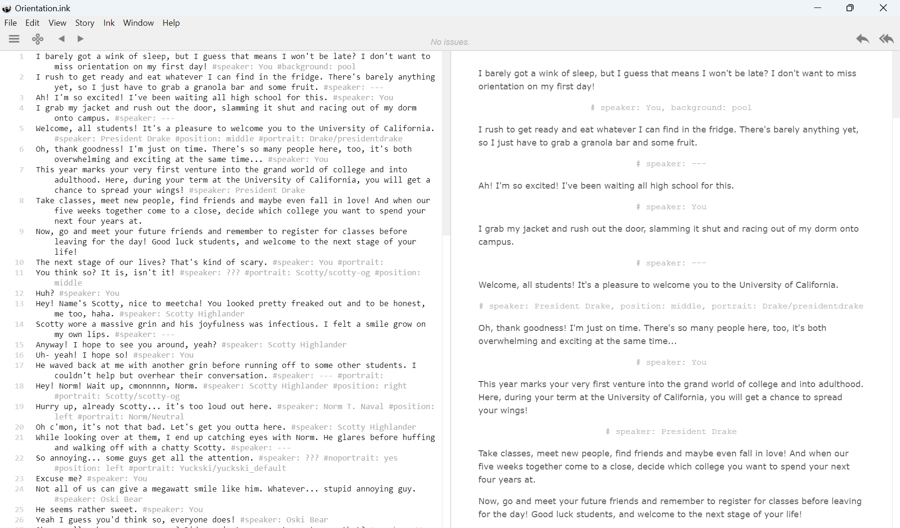

# Here ye, here ye here be thine somewhat readable documentation!

Hi Alvin / whoever is reading this, this is the documentation I whipped up rq for Ink cuz the actual documentation is pretty dog.

And when I say dog, I mean bad dog like relaly bad dog like Chihuahua levels of dog 

not that I have anything against Chihuahuas ok actually I do they barked at me and scared me and cornered me once

# How to Write

Lemme quickly explain how to write the scripts themselves. Each script is written in a .ink file located in the Dialogue folder.

This is most likely what you'll see when you open the file (er the Orientation ink).

Each line is a separate line (i.e. line 1 goes through, you press enter, it goes into line 2)

The black lines will be the text that actually shows up to the players of the game whereas the gray text will be the (i think they call it metadata officially but I'll call it:) tags.

All of these tags are handled in the HandleTags() function in DialogueManager.cs in the same folder you see this.

Basically, if you do something like ``#speaker: You #background: Pool``, it will parse it through HandleTags(), passing in the entire string and it will recognize that it is 2 different commands (split based on :)

Oh yeah and once you create an Ink file, it automatically creates a JSON file alongside it.

# Tags Currently Supported and What They Do

## #position
Other tags that work with this tag: ``#portrait``

By default (assuming no other commands have been called yet), whenever you set the portrait of the character, it will be set in the middle of the screen.

We have 3 different images that can be set on screen at any one time; one in the left, one in the middle, and one in the right.

Say you want Oski Neutral to be put on the right side of the screen. In order to do this, you would call: ``#position: right #portrait: Yuckski/yuckski_default``

If you want to put different characters in different areas of the screen in a single sentence (let's say for a single scene you want Josie on the left and Scotty on the right) you would call: ``#position: left #portrait: Josie/josie_default #position: right #portrait: Scotty/scotty_default``

Values that are accepted (case sensitive): ``right, left, middle``

You do not need to set this every line. You only need to set it once and it will persist (if you last called ``#position: left``, the active position / the position it will change the next time you call ``#portrait`` would change the left image).

## #speaker
Other tags that work with this tag: ``N/A``

This sets the speaker. Pretty straightforward.

An example of this usage would be when the player is talking, you would set ``#speaker: You``

You do not need to set this every line. You only need to set it once and it will persist until you change it.

## #portrait
Other tags that work with this tag: ``Not a tag, but it grabs the images from the Resources/Sprites folder``

This sets the image of the active position to whatever you pass in as the portrait.

In order to call it, you do ``[Name of folder]/[Name of file without extension]``

For example, if you want to set the active image in the default position to be Scotty's angry expression, you would call: ``#portrait: Scotty/scotty_angry``

You do not need to set this every line. You only need to set it once and it will persist until you change it.

## #noportrait
Other tags that work with this tag: ``Nothing``

It only accepts one value: ``yes``

If you call ``#noportrait: yes``, it will delete all current images. That's it. It will not reset the current active position, though, so be wary of that.

## #circle
Same as ``#portrait`` but for the circle instead. Uses the ``Resources/Circles`` folder instead.

## #background
Same as ``#portrait`` but for the circle instead. Uses the ``Resources/Backgrounds`` folder instead.

## #extra
This is a special case. Whatever value you pass in will get passed into the ``switchScene()`` function which switches the current scene. 

Currently, the only supported value is ``class_registration`` which switches the scene to the class registration scene but you can change it to support more.

# How to play an Ink file
SceneChanger.cs is a singleton class which you can access from anywhere. In order to change scenes, you call upon its function, ``SceneChanger.GetInstance().[put your function here]``. An example would be ``SceneChanger.GetInstance().loadOrientation();`` which would call the loadOrientation() functionn inside SceneChanger. Once it calls, it loads the new scene. Sometimes, we might not have to load a new scene, but you will have to do ``DialogueManager.GetInstance().EnterDialogueMode(THE JSON FILE OF THE INK FILE YOU ARE TRYING TO PLAY);`` in order to play the dialogue you are trying to play.

# Afterword
Yeah that's preeeeeeeeeeeeetty much all you need to know to rawdog the dialogue scenes. 

If you need help, refer to the Orientation ink file